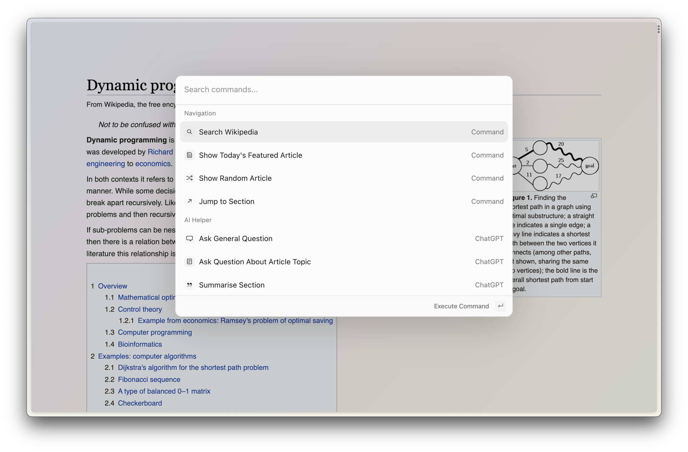
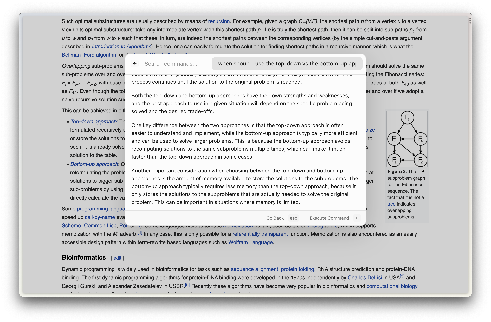
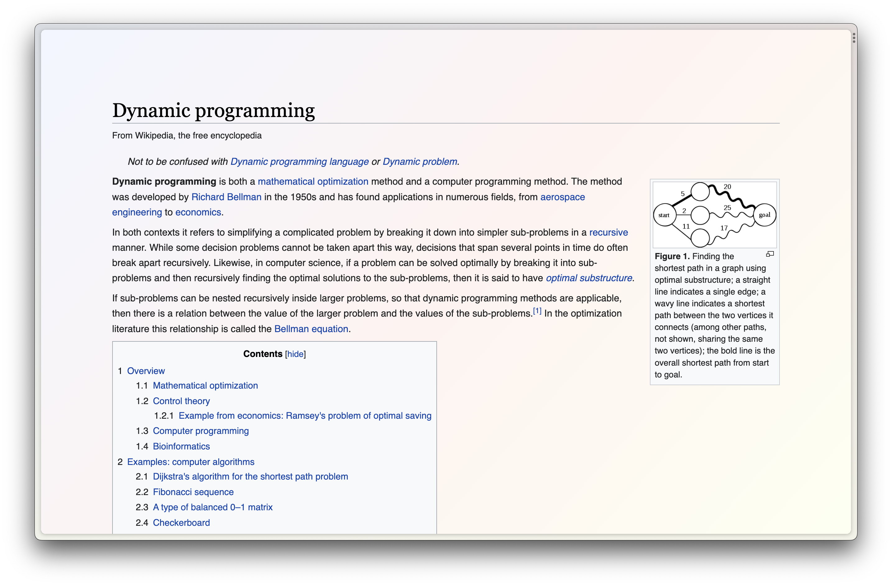

# Wikipedia Boost: ctrl-k
*This is a project I completed as part of a Hackathon organised by the Browser Company. My contribution was ranked top 10 overall (with >100 contributions overall).*

- [Wikipedia Boost: ctrl-k](#wikipedia-boost-ctrl-k)
  - [Installation](#installation)
  - [Description of the boost](#description-of-the-boost)
    - [Why is it important to me?](#why-is-it-important-to-me)
    - [What does it do, what has it let me do with the Internet?](#what-does-it-do-what-has-it-let-me-do-with-the-internet)
      - [Navigational assitance](#navigational-assitance)
      - [AI helper (information retrieval)](#ai-helper-information-retrieval)
      - [Appearance](#appearance)
  - [Response to judging criteria](#response-to-judging-criteria)
  - [Local build](#local-build)

## Installation
1. Go to the [English Wikipedia page](https://en.wikipedia.org/wiki/Main_Page).
2. Click on 'New Boost' in the corresponding Arc menu.
3. Click 'Custom' and 'A specific website' and 'Create Boost'.
4. Copy and paste all the file contents from `boost-template` into the corresponding files using the Arc editor.
5. Click on the options icon (top left in the boost editor status bar), and 'Open in Finder'.
6. Open the `manifest.json` file from the Finder folder in a text editor (it's important that you don't delete or replace it, otherwise Arc gets a bit confused.)
7. Copy the contents of `manifest.json` from `boost-template` into that file, and safe it.
8. Restart Arc to apply the manifest changes.

Go to an English Wikipedia article, press `ctrl + k` and you should be good to go, enjoy!

## Description of the boost

### Why is it important to me?

This boost is important to me because of three reasons:

1. It makes Wikipedia (much) more useful to me, and hopefully to many other people as well.
2. It makes Wikipedia feel more like my own corner of the Internet by being able to change its appearance. Staring at those cold and lifeless colours of Wikipedia for hours and hours when planning a literature review can be depressing! So that's what this boost helps me to avoid.
3. It is the result of stress-testing the limitations of boosts in Arc. Can it communicate with APIs, in a cross-origin manner? Can it access and manipulate cookies to enable state-management; in general, how does it respond to giving or removing boost permissions? What can I do with the `manifest.json` file? Is it possible to use Typescript and Javascript frameworks to develop the boost? I learned about all these things when I developed this boost, it was a valuable lesson. The result (this boost) is something I am quite proud of, so thank you for motivating me to build this by hosting this hackathon:)

### What does it do, what has it let me do with the Internet?

`cmd + k` is a shortcut which is often used to trigger a hidden menu in applications, similar to `cmd + t` in our beloved Arc browser. This boost brings a similar menu to Wikipedia. It currently exposes functionalities including a carefully designed ChatGPT and Wikipedia connection, appearance customisation and navigation.

*Note that this boost is triggered with `ctrl + k`, not `cmd + k` to avoid conflicts with custom shortcuts users may have set up in their Arc configuration. It's probably more likely that they didn't configure a command for `ctrl + k`.*

#### Navigational assitance

- **Search Wikipedia**: this command is useful for when a user has scrolled a long way through a Wikipedia page and now wants to search another page. Without this command, they would need to sroll all the way up to bring the search field back into view. Now, they can simply search for it using the boost. This is also useful as it makes the original seach field redundant and it can therefore be hidden in the focus mode (which is described further below).
- **Show Today's Featured Article**: a nice little feature which automatically links to today's featured article. May motivate more users to actually read that article as it's only featured on the homepage of Wikipedia which I don't visit that often.
- **Show Random Article**: jumps to a random article.
- **Jump to Section**: jumps to a specified section of the current article. This is particularly useful when the article is very long.

#### AI helper (information retrieval)

The main purpose of Wikipedia is to provide information. If a user fails to retrieve the information they wanted, they often need go to another webpage. This process can slow down research processes. This is where the AI helper functionality of this boost comes in. It is a carefully crafted connection between OpenAI's ChatGPT language model and Wikipedia.

- **Ask General Question**: ask ChatGPT a general question. This is the equivalent of just going to [chat.openai.com](https://chat.openai.com/) and posting your question there. However, still useful as now you can do it directly from Wikipedia!
- **Ask Question about Article Topic**: ok this is where it gets interesting. Using this command, you can ask the model questions about the Wikipedia article. For example, when on the [Hello World](https://en.wikipedia.org/wiki/%22Hello,_World!%22_program) page, you could ask `how do I write this in Brainfuck?` and the model will be provided with the necessary context to answer this question.
- **Summarise section**: this summarises a specified section. Useful for quick knowledge exploration.
- **Simplify section**: this expresses a specified section in simpler terms. Useful to tackle comprehension problems.

Please note that large language models have their disadvantages. As such, the retrieved answered might not be 100% factually correct. Bear this in your mind when using this tool.

#### Appearance

- **Focus Mode**: removes all elements that could distract from the article.
- **Dark Mode**: provides a dark mode for Wikipedia. Gotta take care of those strained eyes!
- **Arc Theme Matching**: makes Wikipedia match the theme of your space.

## Response to judging criteria

I developed this boost not only around personal and predicted other people's needs, but also around the below judging criteria.

All of the provided navigation, appearance, and AI helper commmands improve the **utility** of Wikipedia. However, I believe that especially the AI helper will make the most difference to users as they learn how to create goal-directed prompts to retrieve the information they need, in combination with reading a Wikipedia article. This should have a meaningful **Impact** on how users engage with Wikipedia. It (hopefully) motivates people to spend more time on consuming, curating, and enjoying the vast Wikipedia knowledge rather than spending it on Netflix or shopping on Amazon (which is why I chose to build a boost for Wikipedia and not an entertainment website).

When it comes to visual **creativity**, this boost is certainly more subtle at a first glange. When installed, the Wikipdia page is even exactly the same as the original one! My goal was to keep the appearance of the original Wikipedia page more or less unchanged as the goal of that page is to provide information, and I believe that a boastful, colorful appearance change would defeat the purpose of the page. This boost enables users to customise Wikipedia **to their needs and desires**, ranging from subtle changes to more impactful ones.

Another kind of **creativity** which is showcased by this boost: during development, I had to get creative when designing prompts for the language model. How do I provide it with the necessary article context without diluting the original question? How to I simplify a section with the model?

On a last note, the design of the menu was inspired by Raycast, one of my favourite macOS apps.

If you're still reading this, you're amazing! I hope you have a good day.

## Local build
*For after-hackathon purposes and myself, judges may ignore this.*

1. Clone this repository.
2. `cd` into `boost-development` and install the necessary node modules by using `yarn` or `npm install`.
3. `yarn run build`

This will create `dist/index.html` which contains transpiled the Javascript code between the `<script><script/>` tags, and similarly the styles.

The background worker code is based on a custom variation of [this code](https://github.com/wong2/chat-gpt-google-extension/tree/main/src/background), and is currently not an output of the `build` process.
